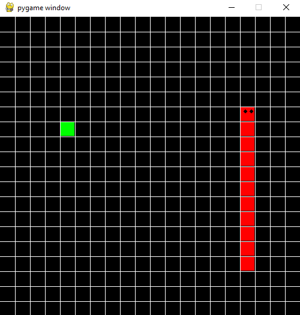

# Snake Game

## Overview
This is a simple implementation of the classic **Snake** game using Python and Pygame. The player controls a snake that grows in length as it eats food, avoiding collisions with itself and the edges of the game area.

## Features
- Classic snake movement and growth mechanics
- Grid-based game board
- Food generation at random positions
- Collision detection for game over
- Simple Pygame-based UI

## How to Play
1. Run the script.
2. Use the arrow keys to control the snake.
3. Eat the green food blocks to grow.
4. Avoid colliding with the snake's own body.
5. The game ends when the snake collides with itself.

## Installation
Ensure you have Python and Pygame installed. Run the game with:

```sh
python snake_game.py
```

## Game Screenshot
Here is a preview of the game:



## Code Structure
- `snake` class: Handles movement and growth of the snake.
- `cube` class: Represents the snake's body segments.
- `move()`: Updates the snake's position based on user input.
- `drawGrid()`: Renders the game grid.
- `redrawWindow()`: Updates the display after each move.
- `randomSnack()`: Generates food at a random location.

## Customization
Modify the game settings by changing:

```python
width = 500   # Window size
rows = 20     # Number of grid rows
speed = 10    # Snake movement speed
```

## License
This project is licensed under the MIT License.

